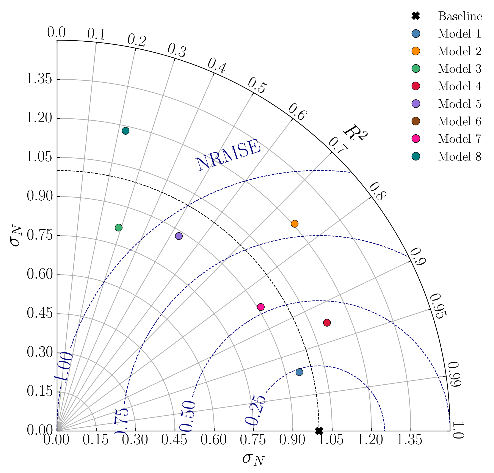

# Taylor Diagram

A generic, self-contained Python implementation of the Taylor diagram — a compact polar plot that summarises how well one or more model outputs reproduce a reference (observed) signal using three statistics simultaneously: the normalised standard deviation (NSD), the correlation coefficient (R), and the normalised centred root-mean-square error (NRMSE).

The Taylor diagram was introduced by Taylor (2001) as a way to condense model evaluation into a single, readable figure. Each model appears as a point on a polar plot: its angular position encodes the correlation with the reference, its radial distance encodes the ratio of model-to-observed variability, and its distance from the reference point encodes the centred RMSE. A model that perfectly reproduces the observations plots exactly on the reference point.

This repository provides a ready-to-run script that generates such a diagram from synthetic sinusoidal signals and prints a companion statistics table to the terminal. It is designed to be easy to adapt to real observed and modelled time series from any domain — oceanography, hydrology, atmospheric science, or any other field where model performance assessment is needed.



---

## Practical application

This implementation was used in the following peer-reviewed study:

> Pappas, K., Nguyen, Q. C., Zilakos, I., Beevers, L., & Angeloudis, A. (2025). On the economic feasibility of tidal range power plants. *Proceedings of the Royal Society A: Mathematical, Physical and Engineering Sciences*, 481(2305), 20230867. https://doi.org/10.1098/rspa.2023.0867

In that paper, Taylor diagrams were used to evaluate and compare hydrodynamic model outputs against observational reference data as part of an integrated framework for assessing tidal range power plants. The framework combined operation strategy optimisation, hydrodynamic impact modelling, and techno-economic analysis (CAPEX and LCOE). The study redesigned 18 tidal range installations across UK sites and demonstrated that equivalent or lower levelised costs of energy can be achieved at substantially reduced capital expenditure, strengthening the economic case for tidal range energy.

---

## Citation

If you use this code, please cite:

1. **The paper above** (practical application and context):
   > Pappas, K., Nguyen, Q. C., Zilakos, I., Beevers, L., & Angeloudis, A. (2025). On the economic feasibility of tidal range power plants. *Proceedings of the Royal Society A*, 481(2305), 20230867. https://doi.org/10.1098/rspa.2023.0867

2. **The original Taylor diagram paper**:
   > Taylor, K. E. (2001). Summarizing model performance in a single diagram. *Journal of Geophysical Research: Atmospheres*, 106(D7), 7183–7192. https://doi.org/10.1029/2000JD900719

---

## Features

- **Normalised Standard Deviation (NSD)** on the radial axis — σ\_model / σ\_obs
- **R² (coefficient of determination)** on the angular axis
- **Normalised centred RMSE (NRMSE)** as dashed contours centred on the reference point
- **Summary statistics table** printed to the terminal before plotting: NSD, R, R², NRMSE for every model
- **Synthetic test signals** — sinusoids with configurable amplitude, frequency, phase, and noise level
- Up to **8 labelled model signals** out of the box, trivially extensible
- Optional **figure export** to PNG (or any matplotlib-supported format)

---

## Known simplifications

| What is omitted | Why it matters |
|---|---|
| Angular axis uses R² (not R) | The original Taylor (2001) diagram uses R; here R² is used on the arc for readability |
| Signals are synthetic sinusoids | Real applications would supply observed and modelled time series directly |
| Only centred RMSE is normalised | Total RMSE includes bias; the centred form used here removes the mean difference |

---

## How to run

```bash
# Install dependencies
pip install numpy matplotlib

# Run (opens interactive window and prints statistics)
python3 taylor_diagram_generic.py
```

To save a figure, set `OUTPUT_FILE = 'taylor_diagram.png'` in the CONFIG block before running.

---

## Diagram layout

```
Angular axis (top arc)  →  R²  (0 = orthogonal, 1 = perfect correlation)
Radial axis             →  NSD = σ_model / σ_obs
Dashed contours         →  NRMSE = √(1 + NSD² − 2·NSD·R)
Reference point (✕)     →  (R²=1, NSD=1) — perfect model
```

A model that agrees well with observations plots close to the reference point: NSD ≈ 1, R² ≈ 1, NRMSE ≈ 0.

---

## Requirements

- Python 3.8+
- numpy
- matplotlib

---

## References

- Taylor, K. E. (2001). Summarizing model performance in a single diagram. *Journal of Geophysical Research: Atmospheres*, 106(D7), 7183–7192. https://doi.org/10.1029/2000JD900719
- Pappas, K. et al. (2025). On the economic feasibility of tidal range power plants. *Proceedings of the Royal Society A*, 481(2305), 20230867. https://doi.org/10.1098/rspa.2023.0867
- [Pearson correlation coefficient — Wikipedia](https://en.wikipedia.org/wiki/Pearson_correlation_coefficient)
- [Root mean square deviation — Wikipedia](https://en.wikipedia.org/wiki/Root_mean_square_deviation)
- [Coefficient of determination — Wikipedia](https://en.wikipedia.org/wiki/Coefficient_of_determination)
